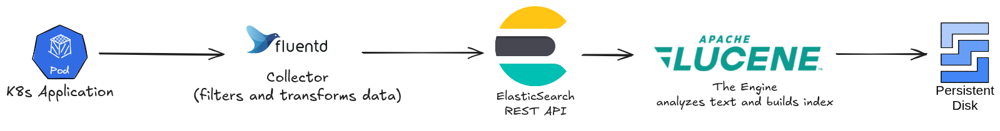
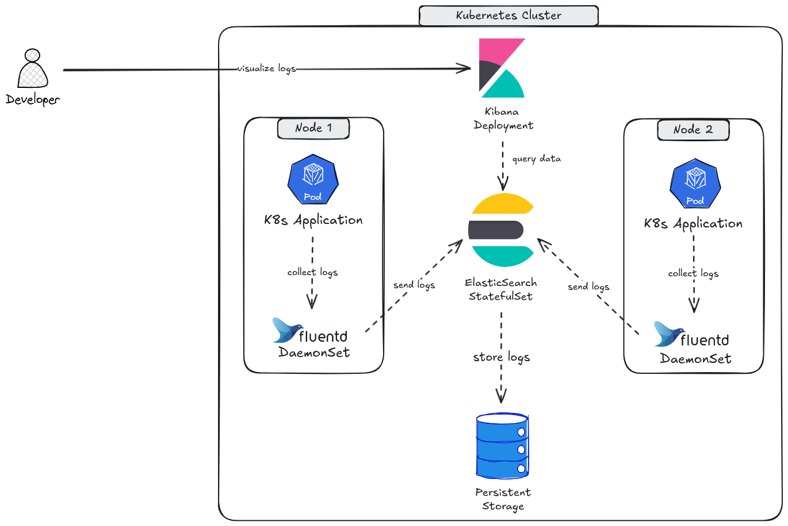
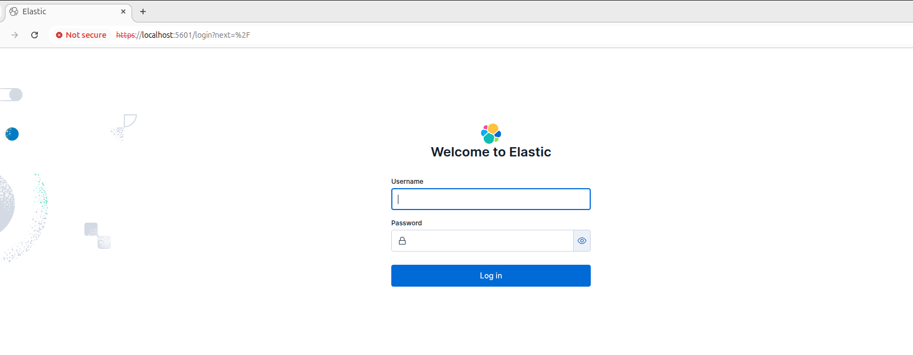
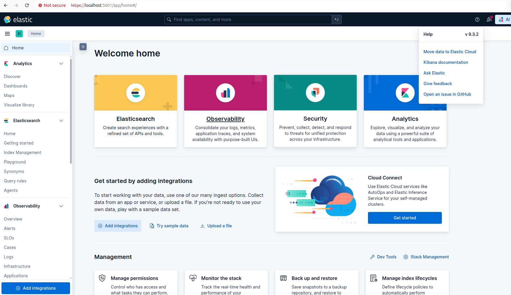

# efk-stack-workshop

This workshop shows the basic concept of installing, configuring and functioning of the EFK monitoring stack in Kubernetes environment


## What is EFK Stack?

EFK stack is an **open-source centralized logging solution** which consists of the following components:
- [Elasticsearch](https://www.elastic.co/elasticsearch) - an open source, distributed search and analytics engine built for speed, scale, and AI applications. As a retrieval platform, it **stores structured, unstructured, and vector data in real time** — delivering fast hybrid and vector search, powering observability and security analytics, and enabling AI-driven applications with high performance, accuracy, and relevance. 
- [Fluentd](https://www.fluentd.org/) - an open source data collector for unified logging layer,
- [Kibana](https://www.elastic.co/kibana) - the open source interface to query, analyze, visualize, and manage data stored in Elasticsearch.

### ElasticSearch

ElasticSearch is built on top of [Apache Lucene](https://lucene.apache.org/), which is a **high-performance Java library** specifically for **full-text indexing and searching**.

Elasticsearch is often classified as a **NoSQL Document Store** because it **stores data as schema-less JSON**, its primary purpose is search and analytics rather than general-purpose transactional storage.



Lucene breaks down the logs entry (text) and creates an entry for these index structures into **Segments** (binary files) on the actual hardware (the disk). This allows Lucen to **store a pre-calculated "words" and know where every word is located** on the disk. This architecture makes ElasticSearch **search through terabytes of logs in milliseconds**

## How EFK Stack Works in Kubernetes Cluster?

In Kubernetes environment EFK stack mostly deployed in the following configuaration:
- **Fluentd**: Deployed as a [Daemonset](https://kubernetes.io/docs/concepts/workloads/controllers/daemonset/), so an agent pod can run on each node to collect the logs from workloads.
- **Elasticsearch**: Deployed as a [StatefulSet](https://kubernetes.io/docs/concepts/workloads/controllers/statefulset/) that stores the data. The service endpoint is exposed for Fluentd and Kibana to connect to it.
- **Kibana**: Deployed as a [Deployment](https://kubernetes.io/docs/concepts/workloads/controllers/deployment/) and connects to the Elasticsearch service endpoint.



## Workshop 

### Prerequisites

Ensure that you have the following tools installed on your machine:
- [Minikube](https://minikube.sigs.k8s.io/docs/start/) installed
- [Helm](https://helm.sh/docs/intro/install/) installed
- [Kubectl](https://kubernetes.io/docs/tasks/tools/) installed

### Kubernetes Cluster

To run two worker node Kubernetes cluster via Minikube:
```bash
minikube start --nodes 3
```

To verify:
```bash
kubectl get no
```

## Sample App

Sample App is a guestbook or a "synthetic" logger from Google Bootcamp on Kubernetes. The Docker image repository is [here](https://gcr.io/google-samples/kubernetes-bootcamp:v1).

To run the app locally:
```bash
docker run -p 8080:8080 gcr.io/google-samples/kubernetes-bootcamp:v1
```
then run sample queries:
```bash
curl localhost:8080
```
You should see the message similar to this:
```bash
Hello Kubernetes bootcamp! | Running on: 146eac9d3e67 | v=1
```

To deploy app into Kubernetes cluster:
```bash
kubectl apply -f app/workshop-app.yaml
```

To port-forward:
```bash
kubectl port-forward deployment/kubernetes-bootcamp 8081:8080
```
then you can send some requests:
```bash
curl http://localhost:8081
curl http://localhost:8081
```

### Elastic Cloud on Kubernetes (ECK) Operator

The [**Elastic Cloud on Kubernetes (ECK) Operator**](https://www.elastic.co/docs/deploy-manage/deploy/cloud-on-k8s) is an application-specific controller that extends the Kubernetes API to manage the lifecycle of the entire Elastic Stack on a K8s cluster.

The ECK Operator automates tasks that are typically difficult to do manually in Kubernetes:

- **Deployment & Scaling**: Automatically configures Nodes, Services, and Persistent Volume Claims (PVCs).
- **Upgrades**: Handles **rolling upgrades of Elasticsearch and Kibana** versions without downtime.
- **Security**: Automatically generates and manages **TLS certificates** for encrypted communication between nodes and users.
- **Configuration**: Manages `elasticsearch.yml` settings across the cluster via Kubernetes Custom Resources (CRDs).
- **Snapshots**: Simplifies backup and restore operations to S3 or GCS.

Starting from ECK 1.3.0, a Helm chart is available to install ECK. It is available from the Elastic Helm repository and can be added to your Helm repository list by running the following command:
```bash
helm repo add elastic https://helm.elastic.co
helm repo update
```

For more information, see [Install ECK using a Helm chart](https://www.elastic.co/docs/deploy-manage/deploy/cloud-on-k8s/install-using-helm-chart)

> [!CAUTION] 
> The minimum supported version of `Helm` is `3.2.0`.    

### ECK Helm Chart

To download the ECK Operator's Helm Chart files, run:
```bash
helm pull elastic/eck-operator --untar 
```

After running the command you should see `eck-operator` Helm Chart folder created at the root of the project:
```bash
eck-operator/
├── Chart.lock
├── charts
│   └── eck-operator-crds
│       ├── Chart.yaml
│       ├── README.md
│       ├── templates
│       │   ├── all-crds.yaml
│       │   ├── _helpers.tpl
│       │   └── NOTES.txt
│       └── values.yaml
├── Chart.yaml
├── LICENSE
├── profile-disable-automounting-api.yaml
├── profile-global.yaml
├── profile-istio.yaml
├── profile-restricted.yaml
├── profile-soft-multi-tenancy.yaml
├── README.md
├── templates
│   ├── cluster-roles.yaml
│   ├── configmap.yaml
│   ├── _helpers.tpl
│   ├── managed-namespaces.yaml
│   ├── managed-ns-network-policy.yaml
│   ├── metrics-service.yaml
│   ├── NOTES.txt
│   ├── operator-namespace.yaml
│   ├── operator-network-policy.yaml
│   ├── pdb.yaml
│   ├── podMonitor.yaml
│   ├── role-bindings.yaml
│   ├── service-account.yaml
│   ├── service-monitor.yaml
│   ├── statefulset.yaml
│   ├── validate-chart.yaml
│   └── webhook.yaml
└── values.yaml
```

Configuration of the ECK Operator is done via `values.yaml`.

Create custom values for our ECK operator:
```bash
# Enable Fluentd
fluentd:
  enable: true

# Tells Helm to automatically install Custom Resource Definitions.
# This allows Kubernetes to understand "kind: Elasticsearch" or "kind: Kibana".
installCRDs: true

# The number of Operator pods to run. 
# 1 is enough for development; production usually uses 3 for High Availability.
replicaCount: 1

# Resource management to ensure the Operator doesn't consume your Minikube node.
resources:
  limits:
    cpu: 500m      # Maximum CPU usage (0.5 cores)
    memory: 512Mi  # Maximum RAM
  requests:
    cpu: 100m      # Guaranteed CPU reserved at startup
    memory: 200Mi  # Guaranteed RAM reserved at startup

# Webhook configuration for validating your Elasticsearch YAML files.
webhook:
  enabled: true
  
  # If the webhook fails, 'Ignore' allows the Operator to keep running.
  # 'Fail' would block all operations if the webhook is unreachable.
  failurePolicy: Ignore
  
  # Automatically creates and rotates the TLS certificates needed for 
  # secure communication between the K8s API and the Operator.
  manageCerts: true

# Internal Operator settings
config:
  # Controls how much information the Operator prints to logs. 
  # "0" is standard info; higher numbers provide more debug data.
  logVerbosity: "0"
  
  # Defines the port where the Operator exports metrics 
  metrics:
    port: 9090
```

To install ECK Operator with these specific values:
```bash
helm upgrade --install eck-operator elastic/eck-operator \
  -n es-operator \
  --create-namespace \
  -f values/es-values.yaml
```

To verify that Elastic Operator pod is running:
```bash
kubectl -n es-operator get po
```
You should see something like this:
```bash
NAME                 READY   STATUS    RESTARTS   AGE
elastic-operator-0   1/1     Running   0          51s
```

To check logs:
```bash
kubectl -n es-operator logs -f statefulset.apps/elastic-operator
```

To list all CRDs managed by this Operator:
```bash
kubectl get crds | grep elastic
```
You should see something like this:
```bash
agents.agent.k8s.elastic.co                            2026-04-06T12:24:27Z
apmservers.apm.k8s.elastic.co                          2026-04-06T12:24:27Z
autoopsagentpolicies.autoops.k8s.elastic.co            2026-04-06T12:24:27Z
beats.beat.k8s.elastic.co                              2026-04-06T12:24:27Z
elasticmapsservers.maps.k8s.elastic.co                 2026-04-06T12:24:27Z
elasticsearchautoscalers.autoscaling.k8s.elastic.co    2026-04-06T12:24:27Z
elasticsearches.elasticsearch.k8s.elastic.co           2026-04-06T12:24:27Z
enterprisesearches.enterprisesearch.k8s.elastic.co     2026-04-06T12:24:27Z
kibanas.kibana.k8s.elastic.co                          2026-04-06T12:24:27Z
logstashes.logstash.k8s.elastic.co                     2026-04-06T12:24:27Z
packageregistries.packageregistry.k8s.elastic.co       2026-04-06T12:24:27Z
stackconfigpolicies.stackconfigpolicy.k8s.elastic.co   2026-04-06T12:24:27Z
```

From this list we need to use the `enterprisesearches.enterprisesearch.k8s.elastic.co` CRD to create an Elasticsearch Deployment.

### Deploying Elasticsearch

For demo purposes we deploy ElasticSearch with a single node and minimal resources:
```yaml
# Specifies the API version and the custom kind defined by the ECK Operator.
apiVersion: elasticsearch.k8s.elastic.co/v1
kind: Elasticsearch
metadata:
  name: quickstart       # The name of the cluster.
  namespace: es-operator # Must match the namespace where your operator is running.
spec:
  version: 9.3.2        # The version of Elasticsearch to deploy.
  nodeSets:
  - name: default
    count: 1             # Creates 1 pod
    config:
      # Roles: This single node does everything (Manages state, stores data, processes logs).
      node.roles: ["master", "data", "ingest"]
      
      # Disables memory mapping. Required for Minikube/Docker environments 
      # to avoid 'max virtual memory areas' errors on the host machine.
      node.store.allow_mmap: false
      
      # Resource Savers: Disables Machine Learning and Watcher (alerting) 
      # to keep the RAM usage low while testing.
      xpack.ml.enabled: false 
      xpack.watcher.enabled: false
      
      # Ensures the cluster is locked down with a password and TLS.
      xpack.security.enabled: true
      
    podTemplate:
      spec:
        containers:
        - name: elasticsearch
          resources:
            # Requests: The minimum resources K8s guarantees for this pod.
            requests:
              memory: 1Gi
              cpu: 200m 
            # Limits: The ceiling. K8s will kill the pod if it exceeds 1.5Gi.
            limits:
              memory: 1.5Gi 
              cpu: 1000m
          env:
          - name: ES_JAVA_OPTS
            # Heap Size: Essential for Java. Sets the min/max memory for the JVM.
            # Usually set to 50% of your container's memory request.
            value: "-Xms512m -Xmx512m" 
            
    volumeClaimTemplates:
    - metadata:
        name: elasticsearch-data # This is the Physical Disk
      spec:
        accessModes:
        - ReadWriteOnce         # Only one node can write to this disk at a time.
        resources:
          requests:
            storage: 2Gi        # Allocated persistent storage for Lucene index files.
```

To deploy the manifest:
```bash
kubectl apply -f manifests/elasticsearch.yaml
```

To verify list all ElasticSearch pods:
```bash
kubectl get pods -n es-operator -l common.k8s.elastic.co/type=elasticsearch
```
or
```bash
kubectl -n es-operator get elasticsearch
```

You should see something like this:
```bash
NAME         HEALTH   NODES   VERSION   PHASE   AGE
quickstart   green    1       9.3.2     Ready   29m
```

> [!CAUTION] 
> As we're using Minikube which runs with `root` permissions by default, you may encounter at first with errors when deploying ElasticSearch pod  
> The main reason is that ElasticSearch do not run as `root` by default for security reasons. To fix issue, we use `init-container`  

### Deploying Kibana

To deploy Kibana use the following manifest file:
```yaml
# Uses the Kibana custom resource definition provided by the ECK Operator.
apiVersion: kibana.k8s.elastic.co/v1
kind: Kibana
metadata:
  name: quickstart       # The name of this Kibana instance.
  namespace: es-operator # Must be the same namespace as your Elasticsearch cluster.
spec:
  version: 9.3.2        # Match this to your Elasticsearch version.
  count: 1               # Only 1 pod wil run.
  
  # The "Glue": This tells Kibana which Elasticsearch cluster to talk to.
  # The Operator automatically handles the credentials and TLS trust between them.
  elasticsearchRef:
    name: quickstart
    
  config:
    # Used for generating links within Kibana on port 5601. 
    server.publicBaseUrl: "http://localhost:5601"
    
  podTemplate:
    spec:
      containers:
      - name: kibana
        resources:
          # Kibana is primarily a Node.js app, so it needs decent RAM to 
          # render the browser-based UI, but less than Elasticsearch.
          requests:
            memory: 512Mi  # Minimum RAM guaranteed.
            cpu: 200m      # Minimum CPU.
          limits:
            memory: 1Gi    # Hard ceiling to prevent Kibana from lagging the node.
            cpu: 1000m     # Max 1 full core allowed during heavy dashboard loading.
```

To deploy:
```bash
kubectl apply -f manifests/kibana.yaml
```

To verify list Kibana pods and services:
```bash
kubectl get pods,svc -n es-operator -l common.k8s.elastic.co/type=kibana
```
or
```bash
kubectl -n es-operator get kibana
```

You should see something like this:
```bash
NAME         HEALTH   NODES   VERSION   AGE
quickstart   green    1       9.3.2     2m26s
```

The default user name of Kibana is `elastic` and to generate password use the following command:
```bash
kubectl get secret quickstart-es-elastic-user -n es-operator -o go-template='{{.data.elastic | base64decode}}'
```

To access the Kibana UI, port-forward the Kibana service:
```bash
kubectl port-forward service/quickstart-kb-http -n es-operator 5601
```

To access UI go to `https://localhost:5601`:



Use `elastic` username and the password to access the UI:



### Deploying Fluentd

There are two main options to deploy Fluentd into Kubernetes cluster:
1. By using Kubernetes Manifest files as Daemonset. For more information, see [Fluentd DaemonSet](https://docs.fluentd.org/container-deployment/kubernetes#fluentd-daemonset)
2. By using Fluent Helm Chart Operator [fluent.github.io/helm-charts](https://fluent.github.io/helm-charts)

For our demo we will use the 1st method by using Daemonset manifest file.

To apply manifests:
```bash
kubectl apply -f manifests/fluentd-rbac.yaml
kubectl apply -f manifests/fluentd-configmap.yaml
kubectl apply -f manifests/fluentd-daemonset.yaml
```

To verify that Fluentd pods are running:
```bash
kubectl get pods -n kube-system | grep fluentd
```
You should see the output similar to this:
```bash
fluentd-bw2sj                      1/1     Running   0          48s
fluentd-f2nhw                      1/1     Running   0          48s
fluentd-nqclv                      1/1     Running   0          48s
```

To view logs of the fluentd pods:
```bash
kubectl logs -n kube-system -l k8s-app=fluentd-logging
```

### Debugging Commands

If you need to restart Operator:
```bash
kubectl rollout restart statefulset quickstart-es-default -n es-operator
```

To restart Fluentd Daemonset:
```bash
kubectl rollout restart ds fluentd -n kube-system
```